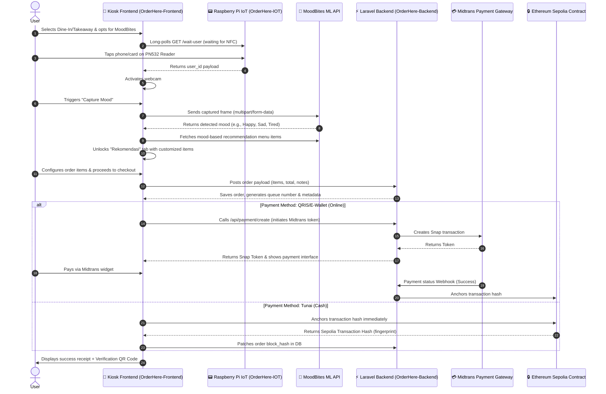

# 🏪 UC-Kiosk: OrderHere 🍕

[](./OrderHere-Backend)
[](./OrderHere-IOT)
[](./OrderHere-Frontend)
[](./OrderHere-DashboardVendor)

**UC-Kiosk (OrderHere)** is a smart, end-to-end food ordering kiosk ecosystem developed for the **UC Canteen** (Universitas Ciputra). This system modernizes the canteen experience through a combination of **facial expression mood detection (MoodBites)**, hardware-integrated **NFC tap authentication**, digital **Midtrans payment integration**, and transaction security via **Ethereum Sepolia Blockchain verification**.

---

## 🗺️ System Architecture

The following diagram illustrates how the frontend client, backend server, Raspberry Pi IoT device, Machine Learning API, and blockchain network interact during a typical user session:



---

## 📦 Ecosystem Components

The codebase is split into 4 core directories:

### 1. [⚡ OrderHere-Backend](./OrderHere-Backend)
A Laravel REST API that serves as the centralized database engine.
* **Core Functions**:
  * Vendor registrations, logins, and API sessions (Laravel Sanctum).
  * Menu catalogs (foods, add-on options, stock status).
  * Order creations, estimations, and status pipelines.
  * Payment integrations (Midtrans Snap token generator, QRIS generator, and transaction callback hooks).
  * Exposes endpoint to log verified transaction hashes from Ethereum Sepolia.
* **Tech Stack**: PHP, Laravel, Eloquent ORM, SQLite/MySQL, Laravel Sanctum.

### 2. [📱 OrderHere-Frontend](./OrderHere-Frontend)
A responsive kiosk screen interface built as a lightweight single-device web client.
* **Core Features**:
  * **Landing Screen**: Select dine-in or takeaway, with automated activity screen savers.
  * **MoodBites Capture**: Interfaces with device webcams, streams frame captures, forwards images to the AI endpoint, and retrieves mood states.
  * **Interactive Cart & Menu Grid**: Grouped by food vendors, filters dynamically by categories (Karbo, Lauk, Sayur, Minuman, Snack), supports custom notes, and configures add-on options.
  * **NFC Listener**: Utilizes long-polling connections to communicate with the local IoT hardware.
  * **Payment Screen**: Processes digital QRIS codes dynamically or coordinates cash receipts backed by **ethers.js** Ethereum transaction proofs.

### 3. [🏪 OrderHere-DashboardVendor](./OrderHere-DashboardVendor)
A single-page web dashboard designed for food stall vendors (e.g., *Chick on Cup*, *Warung AW*).
* **Core Features**:
  * Secure authentication login/register.
  * **Live Queue Monitor**: Visualizes incoming order statuses (`PENDING`, `ONPROGRESS`, `DIANTAR`, `DONE`, `CANCELLED`).
  * **Menu Manager**: Add, edit, or delete dishes, manage pricing, toggle availability, and set add-on customizations.
* **Tech Stack**: Vanilla HTML/JS, FontAwesome Icons, Vanilla CSS styling.

### 4. [📟 OrderHere-IOT](./OrderHere-IOT)
A Python helper utility designed to run on Raspberry Pi boards equipped with a **PN532 NFC reader module**.
* **Core Features**:
  * Establishes SPI interface with the PN532 hardware module.
  * Continuously loops for target Host Card Emulation (HCE) signals.
  * Resolves decoded user IDs from ISO14443 APDU packets.
  * Exposes a Flask server with long-polling API endpoint `/wait-user` for frontend handshakes.
* **Tech Stack**: Python 3, Flask, Adafruit CircuitPython PN532, Adafruit Blinka.

---

## 🛠️ Installation & Setup

### Prerequisites
* **Backend**: PHP >= 8.2, Composer.
* **IoT Hardware**: Raspberry Pi, PN532 Module, SPI jumper wires, Python >= 3.9.
* **Frontend/Dashboard**: A modern web browser with camera permissions enabled.

---

### Setup Instructions

#### A. Backend (Laravel)
1. Navigate to the backend directory:
   ```bash
   cd OrderHere-Backend
   ```
2. Install dependencies:
   ```bash
   composer install
   npm install
   ```
3. Copy environment configurations:
   ```bash
   cp .env.example .env
   ```
4. Generate application key:
   ```bash
   php artisan key:generate
   ```
5. Configure database in `.env` (SQLite is default for easy local development):
   ```env
   DB_CONNECTION=sqlite
   ```
6. Run migrations & populate sample canteen data:
   ```bash
   php artisan migrate --seed
   ```
7. Start the development server:
   ```bash
   php artisan serve --port=8000
   ```

#### B. IoT Service (Raspberry Pi Setup)
1. Wire the **PN532** module to the Raspberry Pi over SPI interface.
2. Navigate to the IoT directory:
   ```bash
   cd OrderHere-IOT
   ```
3. Install dependencies using virtual environments:
   ```bash
   python -m venv venv
   source venv/bin/activate  # On Windows: venv\Scripts\activate
   pip install -r requirements.txt
   ```
4. Start the HCE card reader daemon and web API:
   ```bash
   python main.py
   ```
   *The Flask microservice will launch on port `5000` (listening on all interfaces).*

#### C. Frontend Clients Configuration
1. Open [OrderHere-Frontend/config.js](./OrderHere-Frontend/config.js) and update the `API_CONFIG.BASE_URL` to point to your backend:
   ```javascript
   const API_CONFIG = {
     BASE_URL: 'http://localhost:8000/api',
   };
   ```
2. Open [OrderHere-DashboardVendor/js/config.js](./OrderHere-DashboardVendor/js/config.js) and update its backend base URL similarly:
   ```javascript
   const API_CONFIG = {
     BASE_URL: "http://localhost:8000/api",
     // ...
   };
   ```
3. Serve the HTML folders:
   You can launch the static files locally using any static web server (such as Live Server in VS Code, Python's `http.server`, or Nginx).

---

## 🔒 Blockchain & Payment Details

* **Midtrans Sandbox Integration**: Online payment tokens are fetched using sandbox client key: `Mid-client-bOpWXR3j5IqTiJHI`.
* **Ethereum Sepolia Contract**: Anchors order fingerprints using a deployed Solidity contract at `0x269691dd5963696515612673aE89aa18d0AdA189`.
  * **Order Fingerprint Signature**: Generated via `keccak256(order_id + total_price + salt)`.
  * **ABI Functions utilized**:
    ```solidity
    function anchorOrder(bytes32 _orderHash, address _vendor) external;
    function verifyAndClaim(bytes32 _orderHash) external;
    ```
* **QR Proof**: When transaction anchoring is completed successfully, the transaction fingerprint is updated in the database, and the frontend displays a QR code referencing the unique block signature.

---

## 🧠 MoodBites AI Recommendation Keywords

The system maps food items into smart categories and recommends them depending on the user's emotional state:
* **Happy / High Energy**: Recommends items under the category `Karbo` and `Lauk` (heavy items).
* **Sad / Stressed**: Recommends items under `Snack` or sweet items (comfort foods).
* **Tired / Thirsty**: Recommends items under `Minuman` (refreshers).

Smart categorization logic is automated inside [config.js](./OrderHere-Frontend/config.js) based on database query text matches:
```javascript
const CATEGORY_KEYWORDS = {
  'Karbo': ['nasi', 'mie', 'pasta', 'roti', 'kentang', 'bihun'],
  'Lauk': ['ayam', 'ikan', 'daging', 'sapi', 'telur', 'bakso'],
  'Sayur': ['sayur', 'sop', 'tumis', 'capcay', 'bayam', 'kangkung'],
  'Minuman': ['es', 'jus', 'kopi', 'teh', 'susu', 'lemon', 'matcha'],
  'Snack': ['gorengan', 'keripik', 'kue', 'siomay', 'pisang goreng']
};
```
